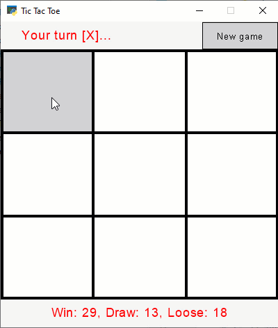

# Tic Tac Toe game made with Python Arcade

## How to install?
1. Install [Python](https://www.python.org/)
2. Install [Arcade](https://arcade.academy)
3. Download and extract [current repository](https://github.com/alderven/TicTacToe/archive/refs/heads/master.zip)

## How to launch?
Go to repository folder and double-click on [main.py](main.py) file

## Ideas for improvements
* "Restart game" button
* Statistics (number of wins/draws/defeats)
* Change game difficulty (easy/normal/hard)
* Resize/fullscreen window
* Dark color scheme
* 2-players game